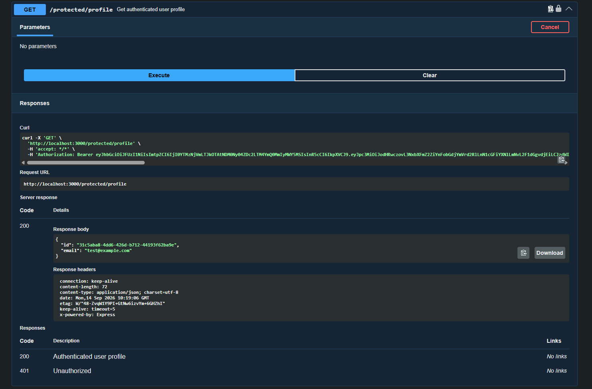

# FlyRank Auth API

A simple authentication REST API built with **Node.js, Express, and Supabase Auth**.

This project implements user signup, login, JWT authentication, protected routes, logout, reusable authentication middleware, and Swagger API documentation.

## Tech Stack

- Node.js
- Express
- Supabase Auth
- JWT
- Swagger UI

## Project Structure

```text
flyrank-auth/
├── docs/
│   └── swagger.png
├── middleware/
│   └── auth.js
├── .env
├── .env.example
├── .gitignore
├── package.json
├── package-lock.json
├── README.md
└── server.js
```

## Environment Variables

Create a `.env` file in the project root:

```env
SUPABASE_URL=your_supabase_project_url
SUPABASE_KEY=your_supabase_anon_or_publishable_key
PORT=3000
```

The `.env` file is excluded from Git using `.gitignore`.

The Supabase `service_role` key is not used.

## Installation

Install the dependencies:

```bash
npm install
```

## Run the API

Start the server with:

```bash
node server.js
```

The API runs at:

```text
http://localhost:3000
```

Swagger UI is available at:

```text
http://localhost:3000/docs
```

## API Endpoints

| Method | Endpoint | Authentication |
|---|---|---|
| POST | `/auth/signup` | Not required |
| POST | `/auth/login` | Not required |
| POST | `/auth/logout` | Bearer token required |
| GET | `/public/info` | Not required |
| GET | `/protected/profile` | Bearer token required |
| GET | `/protected/test` | Bearer token required |

## Authentication Flow

### Signup

Create a new account using:

```http
POST /auth/signup
```

Example request:

```json
{
  "email": "test@example.com",
  "password": "password123"
}
```

Supabase Auth handles account creation and password management.

### Login

Login using:

```http
POST /auth/login
```

Example request:

```json
{
  "email": "test@example.com",
  "password": "password123"
}
```

A successful login returns an access token and refresh token.

### Accessing Protected Routes

Protected routes require the access token in the Authorization header:

```text
Authorization: Bearer <access_token>
```

The access token is verified through Supabase before the request is allowed.

### Logout

Logout using:

```http
POST /auth/logout
```

with a valid Bearer access token.

A successful logout returns:

```text
204 No Content
```

## Public Endpoint

### GET `/public/info`

This endpoint is accessible without authentication.

## Protected Endpoints

### GET `/protected/profile`

Returns information about the authenticated user after successful JWT verification.

### GET `/protected/test`

A second protected endpoint demonstrating reuse of the authentication middleware.

## Authentication Middleware

The reusable authentication middleware:

1. Reads the `Authorization` header.
2. Extracts the Bearer token.
3. Verifies the token using Supabase.
4. Rejects missing or invalid tokens with `401 Unauthorized`.
5. Attaches the authenticated user to the request.
6. Allows the protected route to continue when authentication succeeds.

## Error Handling

| Status Code | Description |
|---|---|
| `200 OK` | Request completed successfully |
| `201 Created` | User successfully created |
| `204 No Content` | Logout completed successfully |
| `400 Bad Request` | Invalid or missing request data |
| `401 Unauthorized` | Invalid credentials, missing token, or invalid/expired token |

## Swagger Documentation

Swagger UI is available at:

```text
http://localhost:3000/docs
```

The protected endpoints are configured with Bearer authentication.

Use the **Authorize** button to enter the JWT access token and test the protected routes directly from Swagger.

### Swagger Screenshot



The screenshot shows the Swagger UI with Bearer authentication and a successful authenticated request to the protected profile endpoint.

## Example curl Output

Example authenticated request:

```bash
curl -i http://localhost:3000/protected/profile -H "Authorization: Bearer <access_token>"
```

Example successful response:

```text
HTTP/1.1 200 OK
Content-Type: application/json

{
  "id": "31c5aba8-4dd6-426d-b712-44193f62ba9e",
  "email": "test@example.com"
}
```

## Security

- `.env` is excluded from Git.
- Supabase credentials are loaded through environment variables.
- The Supabase `service_role` key is not used.
- Password management is handled by Supabase Auth.
- Protected routes require a valid JWT access token.
- Invalid or expired JWTs return `401 Unauthorized`.

## Completed Assignment Stages

### Stage 0 — Setup
- Express server setup
- Supabase project configuration
- Environment variables
- `.gitignore`

### Stage 1 — Signup & Login
- User signup
- User login
- Input validation
- Access and refresh token handling
- Invalid credential handling

### Stage 2 — Public & Protected Routes
- Public endpoint
- Protected endpoint
- Authorization header handling

### Stage 3 — JWT Verification
- JWT extraction
- JWT verification through Supabase
- Invalid or expired token rejection

### Stage 4 — Authentication Middleware & Logout
- Reusable authentication middleware
- Multiple protected routes
- Logout endpoint

### Stage 5 — Swagger
- Swagger UI
- Bearer authentication
- Protected route lock icons
- Authenticated protected-route testing
- Swagger screenshot

### Stage 6 — README & GitHub
- Project documentation
- Environment setup instructions
- API reference
- curl example
- Swagger screenshot
- Public GitHub repository

